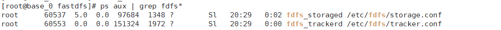

server 服务端
web    客户端 （相对于微服务是客户端，相对于浏览器是服务端）

```
客户端通过rpc调用 得到 rsp和err
服务端最好只要在调用失败或者异常的时候才返回err，否则都返回nil
如果数据操作不成功，但是不是异常，不要返回err，而是把errno设置为不ok

客户端的ctx.Json(http.StatusOk,rsp)，这个ok是说浏览器对我客户端的访问是ok的
```

**fastDFS安装配置**  
*本地安装位置是在/opt/fastDFS*  
*fastDFS: https://blog.csdn.net/qq_64011418/article/details/132226771*  
*fastDFS+nginx: https://blog.csdn.net/bluecard2008/article/details/115743631 , https://blog.csdn.net/wade1010/article/details/134474336*
+ 下载三个源码包
```bash
git clone git@github.com:happyfish100/libfastcommon.git
git clone git@github.com:happyfish100/libserverframe.git
git clone git@github.com:happyfish100/fastdfs.git
```
+ 编译安装
```bash
cd libfastcommon , ./make.sh ./make.sh install , export LD_LIBRARY_PATH=/usr/lib64/ , ln -s /usr/lib64/libfastcommon.so /usr/local/lib/libfastcommon.so

cd libserverframe , ./make.sh , ./make.sh install

cd fastdfs , ./make.sh , ./make.sh install
```
+ 进入 /etc/fafs配置
```bash
vim tracker.conf , 改两个地方: bind_addr 改为自己的ip, base_path 存放日志数据, 可以修改并新建一个log文件夹来存放

vim storage.conf , 改三个地方: bind_addr为本机ip , store_path0和上面的base_path一致即可 , tracker_server改为本机ip

vim client.conf, 该两个地方: 改两个地方: bind_addr 改为自己的ip, base_path 存放日志数据
```
+ 启动存储和监听服务器
```bash
fdfs_storaged /etc/fdfs/storage.conf
fdfs_trackerd /etc/fdfs/tracker.conf
```



 之前的nginx在/usr/local/nginx/sbin目录下
 fdfs的nginx在/opt/nginx-fdfs/sbin目录下